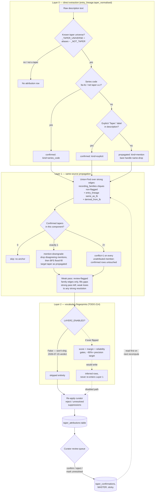
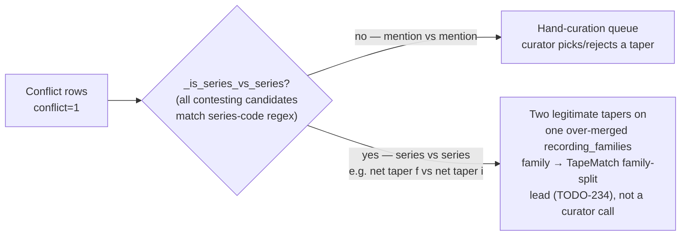

# Taper Attribution Flow

> Sources: `instructions/complete/FABLE_TAPER_ATTRIBUTION.md` (design spec) ·
> `backend/taper_attribution.py` · `backend/taper_fingerprints.py` ·
> `backend/db.py` (`_KNOWN_TAPER_ALIASES`, `_NOT_TAPER`, `_TAPER_UNIVERSE`) ·
> Status: seeded 2026-07-15

End-to-end pipeline that turns raw entry text into a per-LB taper credit with
an auditable confidence tier. Entry point: `backend.taper_attribution.recompute()`
(CLI wrapper: `tools/attribute_tapers.py`).

## Confidence tiers

- **confirmed** — curator `taper_confirmations` row, an explicit `Taper:` label,
  or a series code (`lta`–`ltz`, `net taper a`–`z`). Only this tier renders a
  UI pill (TODO-173/192).
- **propagated** — inherited across a same-source edge from a confirmed (or
  already-propagated) node, or a bare handle *mention* in an entry's own
  description (Layer 0's weakest signal — "thanks to spot" is not "taped by
  spot").
- **inferred** — Layer 2 vocabulary fingerprints. **Implemented but disabled**:
  `taper_fingerprints.LAYER2_ENABLED = False`, a 2026-07-15 calibration verdict
  closed **won't-ship**. Holdout precision (96.2%) didn't transfer to the live
  unattributed pool — profiles latched onto era/setlist/formatting vocabulary
  rather than taper-specific gear tokens, so real misattributions slipped
  through despite clean holdout numbers. `infer()`/`calibrate()` stay
  functional for tests and any future recalibration; `recompute()` simply
  skips the call while the flag is off.

## Pipeline diagram

## Filtering wordlists (`backend/db.py`)

- `_KNOWN_TAPER_ALIASES` — raw-text-key → canonical-name map; the alias
  universe attribution reads.
- `_NOT_TAPER` — labels that must never seed an attribution even though
  they're `_KNOWN_TAPER_ALIASES` keys: mis-parses/source-type noise (`sbd`,
  `aud`, `master`, `mono`, …) and specifically **`dolphinsmile`** (+
  misspellings) — he curates/transfers tapes, he is **not** a taper, so
  mentions of him are uploader credit, not taping evidence. Also excludes
  `lk` (curator), `captain acid` (remasters existing recordings), and `jtt`
  (transfers/masters others' tapes) — TODO-213 curation pass, 2026-07-13.
- `_TAPER_UNIVERSE = frozenset(_KNOWN_TAPER_ALIASES.values()) - _NOT_TAPER` —
  the actual candidate set Layer 0 seeds from and the Library grid's
  `is_known_taper()` checks against, so a display surface never shows a
  taper the attribution engine itself would reject.

## Key rules worth remembering

- **Mention-downgrade**: inside a component with exactly one confirmed taper,
  a disagreeing bare *mention* (Layer 0's weakest tier) is silently dropped
  and re-flooded to the confirmed value rather than raising a conflict — only
  two-or-more **confirmed** tapers in one component trigger `conflict=1`
  (TODO-213, 2026-07-13).
- **Strong wins over weak**: review-flagged (weak) family edges only fill
  gaps the strong pass left empty; a weak edge can never contest or overwrite
  a strong resolution.
- **Family flood-fill**: `_propagate_strong` unions family cliques + same_as +
  derived_from edges via a DSU, then BFS-floods the single uncontested
  confirmed taper to every unattributed member of the component, tagging
  evidence with `kind` (`family`/`same_as`/`derived_from`) and `via_lb`.
- **Sticky curator decisions**: `taper_confirmations` (MASTER) is read first
  on every `recompute()`; `confirm` rows always win, `reject` suppresses one
  named (lb, taper) pair, `unresolved` suppresses *any* taper for that lb
  (genuine two-taper historical conflicts with no ground truth) — both are
  re-applied after Layer 1 (and Layer 2, if ever enabled) so re-derivation
  can't resurrect a rejected/unresolved call.
- **Conflict-queue split**: `list_attributions(conflict_kind=...)` separates
  `mention` (real hand-curation queue) from `series` (series-vs-series —
  both candidates are legitimate formal tapers on one over-merged
  `recording_families` family; the fix is a TapeMatch family split, tracked
  as TODO-234, not a curator confirm/reject decision).

## Related

- [TapeMatch](TapeMatch.md) — `recording_families` origin, family-split leads.
- [Database](Database.md) — MASTER vs USER tables (`taper_confirmations` is
  MASTER/exported; `taper_attributions` itself is USER-tier, recomputed
  locally per F2 of the spec integration notes).
