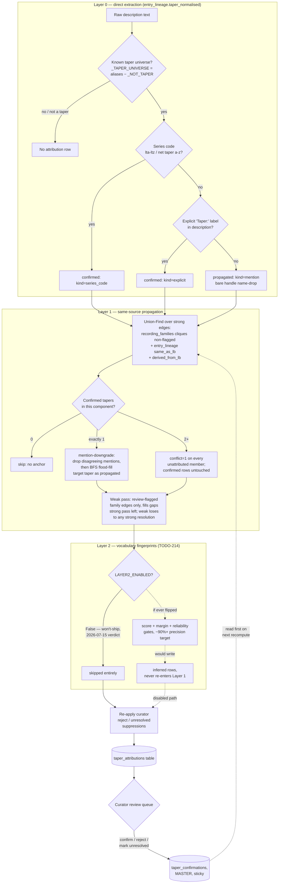
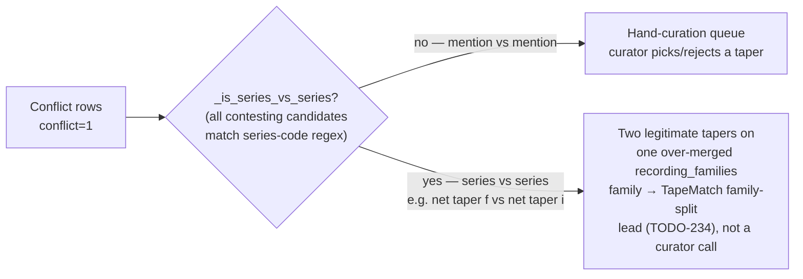

# Taper Attribution Flow

> Sources: `instructions/complete/FABLE_TAPER_ATTRIBUTION.md` (design spec) ·
> `backend/taper_attribution.py` · `backend/taper_fingerprints.py` ·
> `backend/db.py` (`_KNOWN_TAPER_ALIASES`, `_NOT_TAPER`, `_TAPER_UNIVERSE`) ·
> Status: fresh 2026-07-22

End-to-end pipeline that turns raw entry text into a per-LB taper credit with
an auditable confidence tier. Entry point: `backend.taper_attribution.recompute()`
(CLI wrapper: `tools/attribute_tapers.py`).

## Confidence tiers

- **confirmed** — curator `taper_confirmations` row, an explicit `Taper:` label,
  or a series code (`lta`–`ltz`, `net taper a`–`z`). Only this tier renders a
  UI pill (TODO-173/192).
- **propagated** — inherited across a same-source edge from a confirmed (or
  already-propagated) node, or a bare handle *mention* in an entry's own
  description (Layer 0's weakest signal — "thanks to spot" is not "taped by
  spot").
- **inferred** — Layer 2 vocabulary fingerprints. **Implemented but disabled**:
  `taper_fingerprints.LAYER2_ENABLED = False`, a 2026-07-15 calibration verdict
  closed **won't-ship**. Holdout precision (96.2%) didn't transfer to the live
  unattributed pool — profiles latched onto era/setlist/formatting vocabulary
  rather than taper-specific gear tokens, so real misattributions slipped
  through despite clean holdout numbers. `infer()`/`calibrate()` stay
  functional for tests and any future recalibration; `recompute()` simply
  skips the call while the flag is off.

## Pipeline diagram

```mermaid
flowchart TD
    subgraph L0["Layer 0 — direct extraction (entry_lineage.taper_normalised)"]
        A[Raw description text] --> B{Known taper universe?<br/>_TAPER_UNIVERSE =<br/>aliases − _NOT_TAPER}
        B -- no / not a taper --> X1[No attribution row]
        B -- yes --> C{Series code<br/>lta-ltz / net taper a-z?}
        C -- yes --> D[confirmed: kind=series_code]
        C -- no --> E{Explicit 'Taper:' label<br/>in description?}
        E -- yes --> F[confirmed: kind=explicit]
        E -- no --> G[propagated: kind=mention<br/>bare handle name-drop]
    end

    D --> H
    F --> H
    G --> H

    subgraph L1["Layer 1 — same-source propagation"]
        H[Union-Find over strong edges:<br/>recording_families cliques non-flagged<br/>+ entry_lineage same_as_lb<br/>+ derived_from_lb]
        H --> I{Confirmed tapers<br/>in this component?}
        I -- "0" --> J[skip: no anchor]
        I -- "exactly 1" --> K[mention-downgrade:<br/>drop disagreeing mentions,<br/>then BFS flood-fill<br/>target taper as propagated]
        I -- "2+" --> L[conflict=1 on every<br/>unattributed member;<br/>confirmed rows untouched]
        M[Weak pass: review-flagged<br/>family edges only, fills gaps<br/>strong pass left; weak loses<br/>to any strong resolution]
        K --> M
        L --> M
    end

    M --> N

    subgraph L2["Layer 2 — vocabulary fingerprints (TODO-214)"]
        N{LAYER2_ENABLED?}
        N -- "False — won't-ship,<br/>2026-07-15 verdict" --> O[skipped entirely]
        N -. "if ever flipped" .-> P[score + margin + reliability<br/>gates, ~90%+ precision target]
        P -. would write .-> Q[inferred rows,<br/>never re-enters Layer 1]
    end

    O --> R[Re-apply curator<br/>reject / unresolved<br/>suppressions]
    Q -. disabled path .-> R
    R --> S[(taper_attributions table)]
    S --> T{Curator review queue}
    T -->|confirm / reject /<br/>mark unresolved| U[(taper_confirmations,<br/>MASTER, sticky)]
    U -.->|read first on<br/>next recompute| H
```

```mermaid
flowchart LR
    CQ[Conflict rows<br/>conflict=1] --> SC{"_is_series_vs_series?<br/>(all contesting candidates<br/>match series-code regex)"}
    SC -- "no — mention vs mention" --> HR[Hand-curation queue<br/>curator picks/rejects a taper]
    SC -- "yes — series vs series<br/>e.g. net taper f vs net taper i" --> FM["Two legitimate tapers on<br/>one over-merged recording_families<br/>family → TapeMatch family-split<br/>lead (TODO-234), not a curator call"]
```

## Filtering wordlists (`backend/db.py`)

- `_KNOWN_TAPER_ALIASES` — raw-text-key → canonical-name map; the alias
  universe attribution reads.
- `_NOT_TAPER` — labels that must never seed an attribution even though
  they're `_KNOWN_TAPER_ALIASES` keys: mis-parses/source-type noise (`sbd`,
  `aud`, `master`, `mono`, …) and specifically **`dolphinsmile`** (+
  misspellings) — he curates/transfers tapes, he is **not** a taper, so
  mentions of him are uploader credit, not taping evidence. Also excludes
  `lk` (curator), `captain acid` (remasters existing recordings), and `jtt`
  (transfers/masters others' tapes) — TODO-213 curation pass, 2026-07-13.
- `user_taper_flags` (TODO-313) — the runtime override on `_NOT_TAPER`, which
  is otherwise code and un-editable from the UI. `not_taper` rows exclude extra
  canonicals, `is_taper` rows re-admit builtin-excluded ones, and they are
  applied *after* the subtraction so a local call beats the shipped one.
- `_TAPER_UNIVERSE = (aliases.values() - _NOT_TAPER - user_not) | user_is` —
  the actual candidate set Layer 0 seeds from and the Library grid's
  `is_known_taper()` checks against, so a display surface never shows a
  taper the attribution engine itself would reject.

## Key rules worth remembering

- **Mention-downgrade**: inside a component with exactly one confirmed taper,
  a disagreeing bare *mention* (Layer 0's weakest tier) is silently dropped
  and re-flooded to the confirmed value rather than raising a conflict — only
  two-or-more **confirmed** tapers in one component trigger `conflict=1`
  (TODO-213, 2026-07-13).
- **Strong wins over weak**: review-flagged (weak) family edges only fill
  gaps the strong pass left empty; a weak edge can never contest or overwrite
  a strong resolution.
- **Family flood-fill**: `_propagate_strong` unions family cliques + same_as +
  derived_from edges via a DSU, then BFS-floods the single uncontested
  confirmed taper to every unattributed member of the component, tagging
  evidence with `kind` (`family`/`same_as`/`derived_from`) and `via_lb`.
- **Sticky curator decisions**: `taper_confirmations` (MASTER) is read first
  on every `recompute()`; `confirm` rows always win, `reject` suppresses one
  named (lb, taper) pair, `unresolved` suppresses *any* taper for that lb
  (genuine two-taper historical conflicts with no ground truth) — both are
  re-applied after Layer 1 (and Layer 2, if ever enabled) so re-derivation
  can't resurrect a rejected/unresolved call.
- **Conflict-queue split**: `list_attributions(conflict_kind=...)` separates
  `mention` (real hand-curation queue) from `series` (series-vs-series —
  both candidates are legitimate formal tapers on one over-merged
  `recording_families` family; the fix is a TapeMatch family split, tracked
  as TODO-234, not a curator confirm/reject decision). The 2026-07-20 corpus
  rescore refreshed the TODO-234 table 18→14 conflicts, most flipping to
  label-review; final picks await tj.
- **Every decision is logged** (TODO-312): `confirm`/`reject`/`mark_unresolved`
  call `_log_decision()` inside their own transaction, *before* the
  `taper_confirmations` upsert, capturing `prev_action`/`prev_taper` into the
  USER-tier `taper_decision_log`. That pair is what `revert_decision()` replays,
  so an undo needs no recompute. Logging sits in the engine, not the route, so
  CLI callers are recorded too. Undoing a *first-ever* decision is the one case
  that can't be replayed: it drops the `taper_confirmations` row **and** the
  derived `taper_attributions` row (the decision had already rewritten the
  latter to `confidence='confirmed'`) and returns `needs_recompute: true`.

## Curation console (`/taper-review`)

`backend/taper_review.html`, served by Flask, opened directly in a browser —
not part of gui_next. Four tabs over one filter vocabulary:

- **Queue** — the original one-card flow, still defaulting to
  `conflict=1&kind=mention`; other presets select wider slices.
- **Entries** — `GET /api/tapers/review`, the joined/paginated/faceted view
  (`entries` → `taper_attributions` → `taper_confirmations`), with multi-select
  bulk decisions via `POST /api/tapers/attributions/bulk` and a per-row
  expander showing evidence, decision history and a Revert button.
- **Tapers** — `GET /api/tapers/review/tapers` rollup, ordered by undecided
  count; the surface for spotting alias variants and era outliers.

- **Taper list** — `GET /api/tapers/vocabulary`, the master vocabulary (TODO-313).
  Canonical-keyed rather than alias-keyed, because that is the unit a curator
  reasons about: *is this person a taper*, and *are these two names the same
  person*. Per row: alias add/remove, a not-a-taper toggle backed by
  `user_taper_flags`, reset-to-shipped-default, and merge/rename.

Two things about the vocabulary tab are easy to get wrong:

- `_NOT_TAPER` is a **code-level frozenset**; `user_taper_flags` is the only way
  to change that judgement at runtime. It is applied *after* the subtraction in
  `reload_taper_aliases`, so a local `is_taper` always beats the shipped call.
- 32 of the 35 shipped exclusions (including `dolphinsmile`) are never alias
  *values*, so `list_taper_vocabulary` unions `_NOT_TAPER` into the grouped
  alias table. Without that they are invisible and the call is irreversible.
- A **merge carries `taper_confirmations` across**. Those are sticky MASTER-tier
  curator calls; leaving them on the merged-away canonical would silently void
  real decisions. Derived attributions are not rewritten — a recompute does that,
  and `attributions_pending` reports how many are stale meanwhile.

Reads are ungated; bulk, revert and every vocabulary write are curator-gated
like the single-LB routes.
Scale as of 2026-08-17: 8,646 attributions over 273 handles, 136 conflicts, and
only 109 rows carrying a curator decision — the console exists because the old
page could only reach the ~96-row mention-conflict slice.

## Related

- [TapeMatch](TapeMatch.md) — `recording_families` origin, family-split leads.
- [Database](Database.md) — MASTER vs USER tables (`taper_confirmations` is
  MASTER/exported; `taper_attributions` itself is USER-tier, recomputed
  locally per F2 of the spec integration notes).
