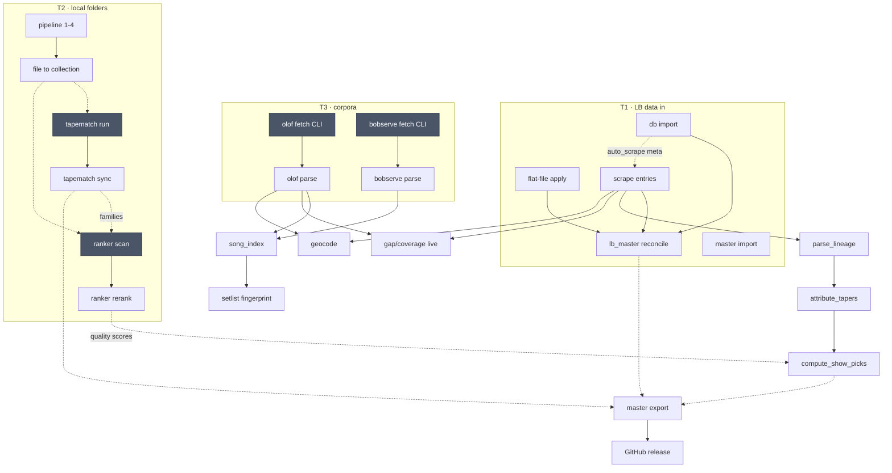

# Pipeline Refresh Inventory

> Written 2026-08-12. Purpose: enumerate **every** step required to bring
> LosslessBob up to date after new data arrives, so the orchestration design
> that follows is built against facts rather than memory.
> **This document describes what exists today. It proposes nothing.**
>
> Sources verified against `backend/app.py` (337 routes), `backend/activity.py`,
> `backend/db.py` (67 tables), `concert_ranker/cli.py`, `tools/`, live `crontab -l`,
> and `docs/wiki/{Collection-Pipeline,Data-Flows,Setlist-Sources,Concert-Ranker,
> TapeMatch,Master-Data-Sync}.md`.

---

## 1. Scope and the four triggers

"Bringing everything up to date" is not one workflow — it is four overlapping
ones, and conflating them is part of why the work feels disjointed. Each trigger
pulls in a different subset of steps.

| Trigger | What happened | Rough step count |
|---|---|---|
| **T1 — new LB data** | A new flat-file checksum DB / master snapshot / site data drop from losslessbob.com | 9 |
| **T2 — new local folders** | New audio landed on disk and needs to become part of the collection | 11 |
| **T3 — upstream drift** | Nothing local changed, but Olof / bobserve / bobdylan.com / setlist.fm / the forum moved on | 8 |
| **T4 — publish** | Local curator-authored data needs to reach other installations (GitHub distribution) | 6 |

T4 is the one most easily forgotten because it is the only trigger with no
local symptom — nothing in the app looks stale when *other people's* copies are
stale. It is also the only trigger that is strictly downstream of all others:
publishing before T1–T3 settle ships half-processed data.

Steps are tagged with their triggers in §2.

---

## 2. The step inventory

Legend for the last column — **Obs** (observability):
- **A** = appears in `backend/activity.py` `JOB_ADAPTERS` (live progress in the status bar)
- **T** = tracked via `activity.track()` (SSE, live only)
- **H** = has a persisted run-history table
- **—** = invisible: no live progress, no history, no "last ran" record

### 2.1 Master / LB data in (T1)

| # | Step | Entry point | Reads | Writes | Depends on | Idem? | Runtime | Obs |
|---|---|---|---|---|---|---|---|---|
| 1 | Discover flat-file releases | `GET /api/flat_file/discover` | LB download page | `flat_file_releases` | — | yes | s | — |
| 2 | Download release | `POST /api/flat_file/download/<id>` | remote zip | local file | 1 | yes | s–m | — |
| 3 | Diff release | `GET /api/flat_file/diff/<id>` | release + `checksums` | — (read-only preview) | 2 | yes | s | — |
| 4 | Apply release | `POST /api/flat_file/apply/<id>` | release | `checksums`, `flat_file_changelog`, `lb_master` | 3 | yes (auto-backup) | m | H |
| 5 | Import checksum DB | `POST /api/db/import` | flat file | `checksums`, `entries` stubs, `meta.last_import_date` | — | yes | m | **A** |
| 6 | Import master snapshot | `POST /api/master/import` | `.db` + manifest | all `MASTER_TABLES` | — | yes (SHA256-verified, pre-backup) | m | — |
| 7 | Install master from GitHub | `GET /api/master/github_check` → `POST /api/master/github_install` | GitHub release | as #6 | — | yes | m | T |
| 8 | Install site-data package | `GET /api/sitedata/github_check` → `POST /api/sitedata/github_install` | GitHub release | `data/site/` mirror | — | yes (SHA256 before extract) | m–l | — |
| 9 | LB-number reconciliation | `POST /api/lb_master/reconcile` → `db.reconcile_all_lb_master()` | `entries`, `checksums`, `entry_files`, `lb_missing` | `lb_master`, `lb_status_history` | 4/5/6 | yes (full rebuild backs up DB) | m | — |

**Finding on #9 — this one is better than feared.** Per-LB reconciliation is
*already automatic*: `reconcile_lb_status()` is called on import
(`backend/importer.py:233`, trigger `"import"`), on scrape
(`backend/scraper.py:280,307,454` + `batch_reconcile_lb_status` at `:532,542`,
trigger `"scrape"`), and on flat-file apply (`backend/flat_file.py:573`, trigger
`"flat_file_apply"`). Only the **full-corpus rebuild** (`reconcile_all_lb_master`,
`backend/db.py:5952`) is manual, and it has **no caller anywhere in the codebase
outside its route** — it is purely a human-remembered action.

### 2.2 Site scraping (T1, T3)

| # | Step | Entry point | Reads | Writes | Depends on | Idem? | Runtime | Obs |
|---|---|---|---|---|---|---|---|---|
| 10 | Scrape entry metadata | `POST /api/scrape/start` (`{start_lb, end_lb, force}`) | losslessbob.com / local mirror | `entries`, `entry_files`, `entry_changes`, `lb_master` | 5 | yes | **hours** (full) | **A** |
| 11 | Scrape one entry | `POST /api/entry/<int:lb_number>/scrape` | same | same | — | yes | s | — |
| 12 | Download raw pages | `POST /api/scrape/download_pages` | site | `data/site/` | — | yes | l | A (as scraping) |
| 13 | Private re-scrape | `POST /api/scrape/private_rescrape` | site (authed) | `entries` (private) | 10 | yes | m | A |
| 14 | Mirror inventory crawl | `POST /api/crawler/start` | site | crawler inventory | — | yes | **hours** | **A** + `scrape_sessions` |
| 15 | Reconcile attachments | `POST /api/attachments/reconcile` | `data/site/` + `entry_files` | attachment cache | 12/14 | yes | m | — |
| 16 | Xref fileset ingest | `POST /api/xref_ingest/scan` → `GET /filesets` → `POST /approve\|/reject` | mirror `LBF-*-xref-*` | staging → `checksums` | 14 | yes | m | — |
| 17 | Bootleg scrape | `POST /api/bootlegs/scrape` | bootleg source | bootleg tables | — | yes | m | **A** |
| 18 | Forum torrent crawl | `POST /api/wtrf/crawl_missing`, `tools/wtrf_fetch_missing.py` | WTRF forum (authed) | torrent records | 9 (needs "missing" set) | yes | l | — |

Step 10 has a real delta notion — it selects unscraped LB numbers unless `force`
is set, and back-fills placeholder rows for numbers in range that `entries`
doesn't know about (`backend/app.py:2487`). It is the **only** scraper with that
property.

### 2.3 Setlist / show corpora (T3)

| # | Step | Entry point | Reads | Writes | Depends on | Idem? | Runtime | Obs |
|---|---|---|---|---|---|---|---|---|
| 19 | Fetch Olof DSN pages | **`.venv/bin/python3 -m backend.olof_fetcher`** (CLI only) | bjorner.com | `olof_pages` (with `fetched_at`) | — | yes (`refresh` flag) | l | **—** |
| 20 | Parse Olof pages | `backend/olof_parser.py` | `olof_pages` | `olof_events`, `olof_songs` | 19 | yes | m | **—** |
| 21 | Parse Yearly Chronicles | `backend/olof_chronicle_parser.py` | `olof_pages` | `olof_chronicle`, `olof_new_tapes` | 19 | yes | m | **—** |
| 22 | Fetch bobserve (2022+) | **`.venv/bin/python3 -m backend.bobserve_fetcher`** (CLI only) | bobserve.com | `olof_pages` (`source='bobserve'`) | — | yes | m | **—** |
| 23 | Parse bobserve | `backend/bobserve_parser.py` | `olof_pages` | `olof_events`, `olof_songs` (ids 9M+) | 22 | yes | m | **—** |
| 24 | Scrape bobdylan.com | `POST /api/bobdylan/scrape` | bobdylan.com | `bobdylan_shows`, `_setlist` | — | yes | m | **A** |
| 25 | Sync setlist.fm | `POST /api/setlistfm/update` | setlist.fm API (key) | `setlistfm_shows`, `_setlist` | API key set | yes | m | **A** |

**This is the sharpest hole in the whole inventory.** Olof and bobserve are the
project's *primary* setlist and bobtalk sources — they feed the song spine, gap
analysis, the dossier, and the geocoder priority chain — and they are the only
corpora with **no Flask route, no GUI surface, and no activity tracking at all**.
`/api/olof/status` is read-only (it reports `events > 0`, which is what the GUI
gates Olof UI on). The two corpora that matter least (bobdylan.com, setlist.fm)
are the two that are fully wired into the app.

### 2.4 Local collection intake (T2)

| # | Step | Entry point | Reads | Writes | Depends on | Idem? | Runtime | Obs |
|---|---|---|---|---|---|---|---|---|
| 26 | Scan a tree for candidates | `POST /api/pipeline/scan-tree`, `/scan-dir` | disk | — (returns list) | — | yes | m | — |
| 27 | Pipeline steps 1–4 | `POST /api/pipeline/run/start` (verify → lookup → lbdir → rename) | folders, `checksums` | `pipeline_file_hash`, `pipeline_folder_state`, `rename_history`, `folder_lb_link` | 26, 5 | yes (fingerprint-cached) | l | **A** + `pipeline_folder_state` |
| 28 | File into collection | `POST /api/pipeline/file/start` (preview: `/file/preview`) | routed folder | disk move + SHA-256 tree verify | 27, `collection_mounts`/`collection_routes` | yes | l | **A** (as filing) |
| 29 | Collection folder scan | `POST /api/scanner/scan` → `/scanner/add`, `tools/scan_collection_folders.py` | disk | collection rows | 28 | yes | m | — |
| 30 | Bulk folder lookup | `POST /api/lookup/scan_folders` | folders + `checksums` | — (read-only) | 5 | yes | m | — |

This is the **best-wired part of the system** — the TODO-205 structural tier gave
it fingerprint-based staleness (`pipeline_folder_state`), warm-start repaint
(`/api/pipeline/state`), per-device work grouping, and activity adapters. It is
the existence proof that the rest of the graph *could* work this way.

### 2.5 Derived data and scoring (T1, T2, T3)

| # | Step | Entry point | Reads | Writes | Depends on | Idem? | Runtime | Obs |
|---|---|---|---|---|---|---|---|---|
| 31 | Parse lineage | `tools/parse_lineage.py:run()` — chain step 1 | `entries` | `entry_lineage` | 10 | yes (wholesale) | m | T (chain) |
| 32 | Attribute tapers | `tools/attribute_tapers.py:run()` — chain step 2 | `entries`, `entry_lineage`, aliases | `taper_attributions` | 31 | yes (wholesale) | m | T (chain) |
| 33 | Compute show picks | `tools/compute_show_picks.py:run()` — chain step 3 | `entries.rating`, `curated_lists`, `entry_lineage`, `quality_recording_scores`, `taper_attributions` | `show_picks` | 32, **41** | yes (wholesale) | m | T (chain) |
| 34 | Song index | `backend/song_index.py:run()` — chain step 4 | `olof_songs` ⋈ `olof_events` | `song_canonical`, `song_performances` | 20/23 | yes (wholesale) | m | T (chain) |
| — | *(the chain itself)* | **`POST /api/derived/recompute`** (SSE, sequential, per-step skip) | — | — | — | yes | m–l | **T** |
| 35 | Song performances (standalone) | `tools/compute_song_performances.py` | as #34 | `song_performances` | 20/23 | yes | m | — |
| 36 | Setlist fingerprinting | `POST /api/fingerprint/scan` → `setlist_fingerprint.run_fingerprint_scan()` | `entries.setlist`, `olof_songs` | `setlist_fingerprint_suggestions` (**review queue**) | 20/23, 34 | yes | m | — |
| 37 | Taper alias curation | `tools/taper_aliases.py`, `_KNOWN_TAPER_ALIASES` in `db.py` | — | alias table | — | manual | — | — |
| 38 | Taper conflict review | `/api/tapers/attributions/<lb>/{confirm,reject,unresolved}` | `taper_attributions` | `taper_confirmations` (MASTER) | 32 | **human** | — | — |
| 39 | Gap / coverage analysis | `backend/gap_analysis.py` — **computed live, no table** | `olof_events` vs `entries` | — | 20/23, 10 | n/a | ms | n/a |
| 40 | LB coverage snapshot | `GET /api/lb/coverage` (`backend/lb_coverage.py`) — **read-only** | `lb_master`, `entries` | — | 9 | n/a | ms | n/a |

Steps 39 and 40 are live-computed and therefore never stale — a good pattern, and
the reason the Library's coverage rows and the award screen always tell the truth.

### 2.6 Concert Ranker (T2)

| # | Step | Entry point | Reads | Writes | Depends on | Idem? | Runtime | Obs |
|---|---|---|---|---|---|---|---|---|
| 41 | Audio quality scan | **`concert_ranker/cli.py scan --all \| --lb N… \| --family F`** (CLI only) | filed audio on disk | `quality_scans`, `quality_recording_metrics` | 28, 43 (families) | yes | **very long** (16 workers) | **—** (has `quality_scans` H) |
| 42 | Rerank from stored metrics | **`concert_ranker/cli.py rerank`** (CLI only) | `quality_recording_metrics` | `quality_recording_scores` | 41 | yes (wholesale) | s–m | **—** |

**The single biggest T2 hole.** `concert_ranker` is referenced from `backend/app.py`
only for its *constants* (`config.resolve_band_set`, `scoring.band_metric` at
`app.py:62–63`) — there is **no route that runs a scan or a rerank**, and neither
appears in `activity.py`. New folders land, get filed, and then sit unscored until
a human remembers to open a terminal. And because #33 (show picks) reads
`quality_recording_scores`, a forgotten scan silently degrades the recommended
pick for every affected date — with no error, no badge, and no way to tell from
inside the app that it happened.

The `scan` → `rerank` split is well designed for this though: RAW metrics are
stored once, so re-banding is cheap. Only #41 is expensive.

### 2.7 TapeMatch (T2)

| # | Step | Entry point | Reads | Writes | Depends on | Idem? | Runtime | Obs |
|---|---|---|---|---|---|---|---|---|
| 43 | TapeMatch run / analysis | `tools/tapematch/` CLI + `/tapematch-batch` skill | audio | `data/tapematch/runs/`, `observations.db` | 28 | resumable (per-run) | **very long** | — |
| 44 | Crawl monitor | `POST /api/tapematch/crawl/start\|stop`, `/status` | run dirs | — | 43 | yes | — | **A** |
| 45 | Family + pair sync | `POST /api/tapematch/sync` | `observations.db` | `recording_families`, `tapematch_family_meta` (MASTER), `tapematch_pairs` (USER) | 43 | yes | m | — |
| 46 | Pair / date judgments | `/api/tapematch/pairs/judgment`, `/api/tapematch/dates/accept` | pairs | judgments | 45 | **human** | — | — |

Nightly automation exists but lives **outside the app entirely** — verified live
crontab (4 batches, not 5):

```
15 23 * * *  data/tapematch/cron_batch.sh
45 01 * * *  data/tapematch/cron_batch.sh
15 04 * * *  data/tapematch/cron_batch.sh
45 06 * * *  data/tapematch/cron_batch.sh
```

The app cannot see that these ran, whether they succeeded, or how much backlog
remains. `/api/tapematch/crawl/status` observes run-dir *count* on disk, which is
the closest thing to a signal.

### 2.8 Geocoding (T1, T3)

| # | Step | Entry point | Reads | Writes | Depends on | Idem? | Runtime | Obs |
|---|---|---|---|---|---|---|---|---|
| 47 | Geocode locations | `POST /api/geocode/run` (`{retry_failed, limit}`), `tools/geocode_locations.py` | `entries.location`, `olof_events.venue`, gazetteer | `location_geocoded` | 10, 20/23 | yes (skips already-geocoded) | l (rate-limited) | **A** |
| 48 | Manual location fix | `POST /api/geocode/location` | — | `location_geocoded` | 47 | human | — | — |

Well behaved: has a genuine delta (only un-geocoded rows unless `retry_failed`),
a stop route, stats, and an activity adapter. Along with #10 and #27, one of only
three steps with a real incremental notion.

### 2.9 Integrity and verification (continuous)

| # | Step | Entry point | Writes | Idem? | Obs |
|---|---|---|---|---|---|
| 49 | Collection integrity scan | `POST /api/collection/integrity/scan` | `collection_integrity_scans`, `collection_integrity_status` | yes | **A** + H |
| 50 | File integrity scan (per mount) | `POST /api/file-integrity/scan` | `file_integrity_scans` | yes | **A** (multi-job) + H |
| 51 | Background watchers | `backend/scheduler.py`: `start_file_watcher`, `start_collection_watcher`, `start_integrity_scan_scheduler`, `start_file_verify_scheduler` | `integrity_events` | yes | partial |

**These are the only steps in the entire system that schedule themselves.** They
are also, not coincidentally, the only ones nobody complains about forgetting.

### 2.10 Publish / distribution (T4)

| # | Step | Entry point | Reads | Writes | Depends on | Gate | Obs |
|---|---|---|---|---|---|---|---|
| 52 | Export master snapshot | `POST /api/master/export` (`{reason, channel}`) | `MASTER_TABLES` + `MASTER_META_KEYS` | `.db` + manifest (SHA256) | everything upstream | **curator** | — |
| 53 | Publish master to GitHub | `POST /api/master/github_release` (SSE, 1 MB chunks) | export from 52 | GitHub release | 52 | **curator**; refuses non-`public` manifest | T |
| 54 | Package site data | `POST /api/package/scrape_data` | `data/site/` | core + files zips | 12/14 | curator | — |
| 55 | Publish site data to GitHub | `POST /api/sitedata/github_release` (SSE) | 54 | release `sitedata-<YYYY-MM-DD>` (2 zips + 2 manifests) | 54 | **curator** | T |
| 56 | Preservation snapshot | `POST /api/preservation/start` | collection | snapshots + reports | 28 | — | — |
| 57 | archive.org upload | `POST /api/archive_org/upload` | collection | archive.org items | 28 | credentials | **A** |

Both GitHub flows obtain their token via `gh auth token` and upload with
byte-accurate progress. The channel guard is real and load-bearing:
`master_github_release` **refuses any non-`public` manifest**, so the `full`
(friends-only, private metadata intact) channel can never be pushed to the public
repo by accident.

**Why this trigger gets forgotten (D7 below):** publishing is the only step whose
staleness is invisible locally. Nothing in the app says "your last published
master is 6 weeks and 340 entries behind your local one." The export is a
point-in-time act with no record of what was current when it ran, so there is no
diff to show. Note also that `docs/schema.html` auto-deploys to Cloudflare Pages
via a PostToolUse hook — the *only* fully automatic publish in the project, and
the only one nobody has to remember.

---

## 3. Dependency graph

Solid edges are enforced in code. **Dashed edges exist only in someone's head** —
nothing prevents running the downstream step against stale upstream data.



Edges worth naming explicitly:

- `attribute_tapers → compute_show_picks` — **enforced** by chain ordering in
  `/api/derived/recompute`; picks' taper-reputation term must see fresh
  attributions (`SPEC_INTEGRATION_NOTES.md` finding F5).
- `ranker rerank → compute_show_picks` — **not enforced.** Picks reads
  `quality_recording_scores` but has no idea whether a scan is outstanding.
- `file → ranker scan` — **not enforced.** The ranker walks filed paths; nothing
  tells it new ones appeared.
- `tapematch sync → ranker scan` — **not enforced.** The ranker compares
  recordings *within* a family, so a stale family map silently changes rankings.
- `olof parse → song_index / gap / geocode` — **not enforced**, and the upstream
  fetch isn't even reachable from the app.
- `everything → master export` — **not enforced.** Nothing blocks or warns on
  publishing mid-refresh.

The four grey nodes (`olof fetch`, `bobserve fetch`, `ranker scan`, `tapematch
run`) are the graph's roots-of-record that live entirely outside the application.

---

## 4. The disjoints

**D1 — There is no staleness ledger.** The only "when did this last run" record
in the whole project is `meta.last_import_date`. Verified: a sweep of every
`set_meta()` call in `backend/` yields exactly seven keys, of which one is a
timestamp of anything. Some steps have *history* tables (`quality_scans`,
`collection_integrity_scans`, `file_integrity_scans`, `flat_file_releases`,
`scrape_sessions`, `lb_status_history`) but these record *runs*, not *staleness*,
and no code reads them to answer "does this need to run again?"
`pipeline_folder_state` is the sole real staleness model — and it covers steps
27–28 only.

**D2 — Three execution surfaces, no shared entry point.** Flask routes (~40
steps), `tools/`+`concert_ranker` CLI (steps 19–23, 31–35, 37, 41–43), and a
machine-local crontab (step 43). The CLI-only set contains the project's primary
setlist source *and* its quality scoring — the two things whose absence is
hardest to notice from the GUI.

**D3 — Ordering is tribal knowledge.** `/api/derived/recompute` is the only
codified sequence, and it covers 4 of ~57 steps. Every other edge in §3 is
enforced by memory.

**D4 — Almost nothing computes a delta.** Only three steps know what's new:
`/api/db/import` (`new_lb_numbers`, and it's the one place chaining already
happens — it auto-queues a scrape when the `auto_scrape` meta flag isn't `"0"`),
`/api/scrape/start` (unscraped rows unless `force`), and `/api/geocode/run`
(un-geocoded rows unless `retry_failed`). Everything else is all-or-nothing over
the whole corpus — which is precisely why refreshes are expensive enough to defer,
which is why they pile up.

**D5 — Human gates sit mid-graph and stall silently.** Xref approve (#16), taper
conflicts (#38), TapeMatch judgments (#46), setlist-fingerprint suggestions (#36).
Each is a queue with no "N items waiting" surface outside its own screen, and
each blocks downstream quality without any downstream signal.

**D6 — No completeness signal.** `/api/lb/coverage` answers "how much of LB do I
hold." Nothing answers "how much of what I hold is fully processed" — i.e. filed
∧ scanned ∧ ranked ∧ family-matched ∧ taper-attributed ∧ geocoded. The data to
compute that exists; nothing joins it.

**D7 — Publishing has no staleness signal at all** (see §2.10). It is the only
trigger whose neglect is invisible from inside the app, because the cost lands on
other people's installations.

**D8 — `activity.py` observes but does not remember.** Its history is a 50-entry
in-memory ring buffer, explicitly "memory-only, cleared on restart" (spec D-4
default). So even the steps that *are* instrumented lose their record on every
backend restart — and the repo's own workflow rules mandate frequent restarts.

---

## 5. What a workflow would have to do

Requirements only — derived from §4, so the design session has a spec to hit.
No design decisions here.

1. **Give every step a durable last-run record** keyed by step + input scope,
   surviving restart (fixes D1, D8).
2. **Give every step one callable entry point** from a single surface, including
   the four that are CLI/cron-only today (fixes D2).
3. **Encode the §3 graph once**, so ordering is data rather than memory, and
   downstream steps can be marked dirty by upstream ones (fixes D3).
4. **Make the expensive steps incremental** — accept an affected-LB / affected-
   folder set rather than always running the whole corpus (fixes D4). The
   `scan`/`rerank` split in `concert_ranker` and `pipeline_folder_state` show the
   shape.
5. **Surface pending human queues as first-class blockers** with counts, so a
   stalled review is visible before it degrades output (fixes D5).
6. **Answer "what is not up to date"** in one place, per trigger, including
   publish lag (fixes D6, D7).
7. **Respect what already exists** — `activity.py` must keep *observing, never
   owning* (its stated one rule); the orchestrator triggers workers, it does not
   replace them.
8. **Never auto-run the destructive or the very expensive** without consent:
   ranker full scan, full-corpus rescrape, master publish.

---

## 6. Open questions for tj

1. **How often does the LB flat-file DB actually drop?** Determines whether T1
   should poll (`/api/flat_file/discover` on a timer) or stay manual.
2. **Should the TapeMatch cron move inside the app**, or stay a machine-local
   crontab that the app merely *reads the state of*? (It currently predates any
   orchestrator and works.)
3. **Is `concert_ranker scan` acceptable to auto-run on newly filed folders?**
   It is the longest step in the system. An incremental `--lb N…` scan of just
   the new arrivals may be cheap enough; a full `--all` never will be.
4. **Should publish be gated on a clean refresh** — i.e. refuse/warn on
   `/api/master/export` while any upstream step is dirty — or stay unguarded?
5. **Olof/bobserve fetch: route, or keep CLI?** Wrapping them is the single
   highest-value fix in §4, but it puts scraping bjorner.com on a button.
6. **Is there a step this document is still missing?** The inventory was built by
   sweeping routes, `tools/`, and the wiki — anything driven purely by habit and
   never written down would not appear here.

---

## Appendix — verification performed

- All 57 route strings grepped against `backend/app.py`; all script paths
  confirmed present in the tree.
- All named tables confirmed against `CREATE TABLE IF NOT EXISTS` in
  `backend/db.py` (67 total).
- `crontab -l` read live (4 tapematch batches — the "5×" in an older memo is
  stale).
- `reconcile_*` call sites enumerated repo-wide (§2.1 finding).
- `set_meta()` key sweep across `backend/` (D1 evidence).
- Cross-checked against `docs/wiki/Data-Flows.md` §Main flows: all 9 flows map
  onto inventory rows (1→#5/#30, 2→#10–15, 3→#19–25, 4→#31–34, 5→#52–55/#6–8/#16,
  6→#26–29/#49–51, 7→#43–46, 8→#41–42/#33, 9→#39–40). No inventory row lacks a
  flow except #56–57 (preservation / archive.org), which the wiki covers under
  [Integrations](../docs/wiki/Integrations.md) instead.
